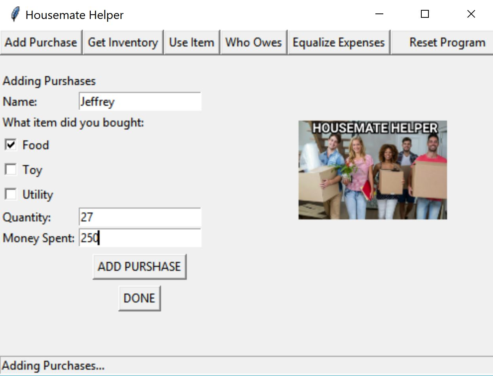
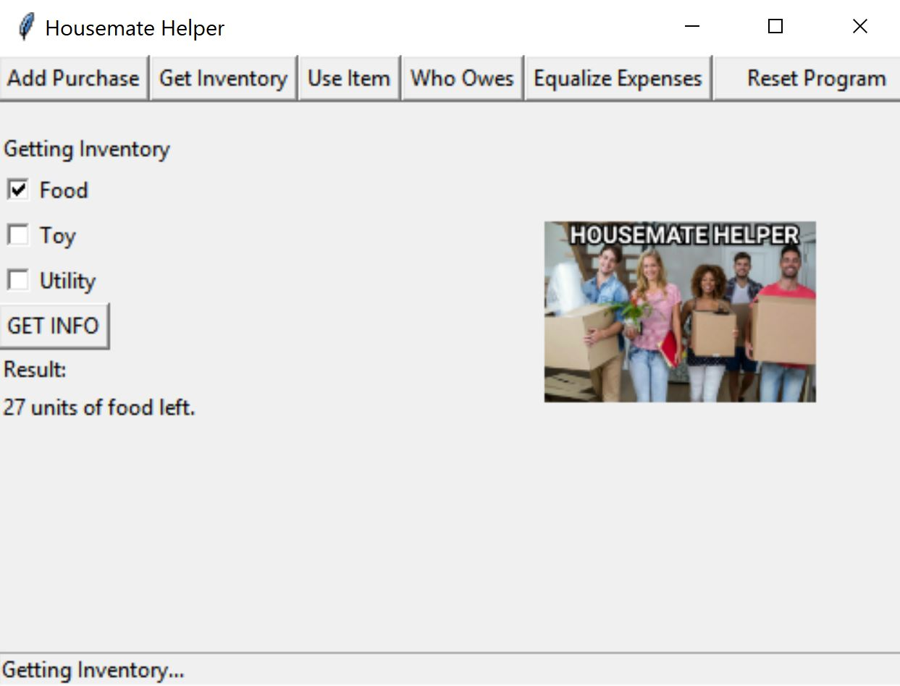

# HousemateHelper
1.	This program makes easier the sharing of expenses among a group of housemates and helps them with the maintaining of inventory.
2.	The program creates a record of each person. Prompting one at the time to enter:
    A.	The name of the individual.
    B.	The item bought: Food, Utility, or Toy.
    C.	The quantity of the item bought. 
    D.	The money spent.
3.	The program keeps track of the quantity of each item (Food, Utility, or Toy).
4.	The program allows the user to indicate that they have used a number x of an item. 
    A.	  X number of that item are remove from the inventory. 
    B.	 Tell the user how many of each item are left.
5.	The program makes sure that all the housemates spent the same amount of money.
    A.	Examines the total amount of money spent.
    B.	Examines how much each person spent.
    C.	Calculates how much one person should pay to another.
6.	The program then print out a summary informing:
    A.	The amount of money that a housemate need to pay to another. 
    B.	The amount of each item that are left in the house. 

